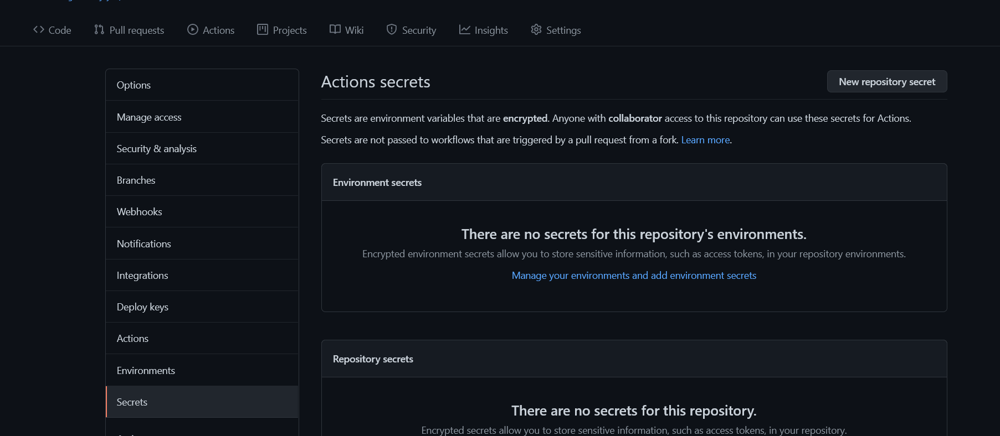

<h1>Lazy Leech Manually Deploy via Heroku X Github Actions</h1>
<h3>This page will tell you how to deploy Lazy Leech to heroku without suspension on Github Actions</h3>

> Do not overuse it, or your account might be banned by Heroku.
> This is Not for abusers at all
> Dont abuse github actions...lets stay under the radar..

### 👉Pre Requisites🥱
1️⃣ [Heroku Account](https://heroku.com) --- **mostly importantly needed for heroku api key and deployment**

2️⃣ [Telegram Account](https://telegram.org) --- **mostly importantly needed for the bot to work** 

3️⃣ [Some Patience](https://www.google.com/search?q=how+to+be+more+patient)

4️⃣ [Mongo DB-URL (not necessary or mandatory only needed if want to add auto download feature)](https://del.dog/mongodb_guide)

### Deployment instructions,Some Recomendations and Notes🤗

🔷 **Here I Don't Provide any Deploy button to heroku, We Use Github Actions to Deploy container to Heroku**

🔷 **It is Reconmended to use any DC-4/DC-2 bot token and Heroku Deployment Region should be EU... **❓why I am saying that?**  **In order to get High Upload Speed In telegram Leech Upload it is recomended** **you will get about 20MiB/s in TG upload which is equal to 200mbps and in normal DC-1/DC-5 bot you will get 5MiB/s which is equal to 50Mbps😆**
   > **To get DC-4 token (i will make bot with your own username and name and transfer its ownership to you via botfather) CONTACT `@XCODERSHUB` FOR MORE...**
 
🔷 **Make sure to Set the vars correctly in Github-Actions** ❌Dont edit/delete any ENV vars from heroku or Dont add any new vars from heroku either...
   > **to edit/add/del ENV vars...Simply go to github actions and rerun the workflow**

🔷 **If you edit any file or Stuff from Git-Repo you will have to RE-RUN the workflow again or else you will face no changes LOL** 

#### Steps

🎈1. **Fork this Repo**

🎈2. **Go to Repository `Settings` -> `Secrets`**
    
    
🎈3. **Now set the below Variables in the Github Repository Secrets**
    [Environmental Variables](#environment-variables)

🎈4. **After filling the Required vars .... go to Actions and then tap on Run the Workflow**
    

🎉5. **now wait it for it to deployed to heroku and Check app logs and Turn on Workers If OFF** **if everything is OK then send /help to the bot or try other cmds**... **fun fact Bot has No Response to /start cmds**
   

## Environment Variables

### 🔴Required Environmental Variables... MUST BE GIVEN.... This Required ENV var is for Heroku Deployment only

| Variable | Value | Example | Required | Description |
| :---: | :---: | :---: | :---: | :---: |
| HEROKU_EMAIL | Heroku email | abc@abc.com | True | Just Give the email you used for Heroku Account|
| HEROKU_API_KEY | Heroku API key | xxxxxxx-xxxx-xxxx-xxxx-xxxxxx | True | Get it from [Heroku](https://dashboard.heroku.com/account/applications/authorizations/new) |
| HEROKU_APP_NAME | Heroku app name | Name Must be unique | True | Heroku app name that needs to be Updated or Created (Should be in lowercase) |
| BOT_TOKEN | Telegram Bot Token | your telegram bot api key/token | True | Create a bot using [@BotFather](https://telegram.dog/BotFather), and get the  API token. |
| API_ID | Telegram API_ID | Your TG account's API_ID | True | Get this value from [TELEGRAM](https://my.telegram.org/apps). |
| API_HASH | Telegram API_HASH | Your TG account's API_HASH | True | Get this value from [TELEGRAM](https://my.telegram.org/apps). |
|ADMIN_CHATS | Authorized Chats | Chats where this bot will respond and leech | True | Create a Super Group in Telegram, add `@missrose_bot` to the group, and send /id in the chat, to get this value. |

### 🟢Not Required Environment Variables.

  "DB_URL" = "Mongodb url from https://cloud.mongodb.com/, guide: https://del.dog/mongodb_guide, if want to add auto download feature"

  "NYAA_RSS_LINKS" = "Add multiple nyaa links you wish to auto-download animes from, else leave it and will auto-download animes from AWS in all admin chats [Useless if no DB_URL added]"

  "RSS_RECHECK_INTERVAL" = "Add time in minutes, key is self-descriptive, set recheck interval else default is 5 minutes [Useless if no DB_URL added]"

> **IF YOU WANT TO SET optional vars then go to your deployed heroku app settings and add the vars ...**

## DONT TOUCH/EDIT ANY VARS FROM HEROKU if want to change/edit do from Github...

## IF YOU WANT TO SET optional vars then go to your deployed heroku app settings and add the vars ...
